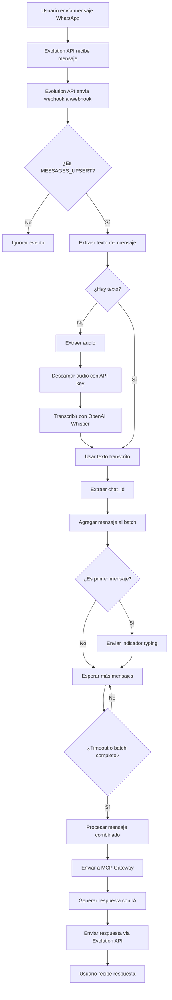

# 📱 Guía Completa: Evolution API en Healtfolio

## 🎯 **Resumen**

Healtfolio utiliza **Evolution API** como uno de los proveedores de WhatsApp para recibir y enviar mensajes. Esta guía explica detalladamente cómo funciona toda la implementación.

## ⚙️ **Configuración y Variables de Entorno**

La aplicación está configurada para usar Evolution API a través de estas variables de entorno:

```python
# Configuración Evolution API
EVO_URL = os.getenv("EVOLUTION_BASE_URL")
if EVO_URL:
    EVO_URL = EVO_URL.rstrip("/")

EVOLUTION_API_KEY = os.getenv("EVOLUTION_API_KEY")
INSTANCE_ID = os.getenv("EVOLUTION_INSTANCE_ID")
WHATSAPP_PROVIDER = os.getenv("WHATSAPP_PROVIDER", "evolution").lower()
```

### **Variables Requeridas (.env)**
```bash
# === CONFIGURACIÓN GENERAL ===
WHATSAPP_PROVIDER=evolution  # "evolution" o "twilio"

# === EVOLUTION API ===
EVOLUTION_BASE_URL=https://evolution-db.onrender.com
EVOLUTION_API_KEY=tu_api_key_aqui
EVOLUTION_INSTANCE_ID=tu_instance_id_aqui
```

## 🔗 **Webhook de Evolution API**

### **Endpoint Principal**
- **URL**: `POST /webhook`
- **Propósito**: Recibe mensajes de WhatsApp desde Evolution API

### **Flujo de Procesamiento**

```python
@app.post("/webhook", status_code=200)
async def webhook_evolution(request: Request):
    """Webhook para Evolution API."""
    try:
        event_json = await request.json()
        logger.info(f"Received Evolution webhook: {event_json}")

        # Solo reaccionamos a MESSAGES_UPSERT
        event_name = event_json.get("event", "").upper().replace(".", "_")
        if event_name != "MESSAGES_UPSERT":
            logger.info(f"Event ignored (not MESSAGES_UPSERT): {event_json.get('event', '')}")
            return {"status": "ignored"}

        user_text = extract_text_from_event(event_json)

        # Si no hay texto, intentar extraer audio y transcribirlo
        if not user_text:
            audio_info = extract_audio_from_event(event_json)
            if audio_info:
                logger.info(f"🎙️ Audio detectado (Evolution): {audio_info}")
                try:
                    if "base64" in audio_info:
                        import base64
                        audio_bytes = base64.b64decode(audio_info["base64"])
                    else:
                        audio_bytes = await download_media(audio_info["url"], provider="evolution")
                    
                    # Elegir extensión adecuada a partir del mimetype
                    mt = audio_info.get("mimetype", "audio/ogg")
                    ext = "ogg"
                    if "/" in mt:
                        ext = mt.split("/")[-1]
                        if ";" in ext:
                            ext = ext.split(";")[0]
                    filename = f"note.{ext or 'ogg'}"
                    user_text = await transcribe_audio(audio_bytes, filename=filename, mimetype=mt)
                    logger.info(f"📝 Transcripción obtenida: '{user_text}'")
                except Exception as e:
                    logger.error(f"❌ Error transcribiendo audio Evolution: {str(e)}")
                    user_text = None
        
        if not user_text:
            logger.info("No text or audio to process")
            return {"status": "no_text"}

        chat_id = get_chat_id(event_json)
        logger.info(f"Processing message: '{user_text}' from {chat_id}")
        
        await process_message_with_batching(chat_id, user_text)

        return {"status": "ok"}
        
    except Exception as e:
        logger.error(f"Evolution webhook error: {str(e)}", exc_info=True)
        return {"status": "error", "message": str(e)}
```

### **Tipos de Eventos Procesados**
- ✅ **MESSAGES_UPSERT**: Mensajes entrantes (texto y audio)
- ❌ **Otros eventos**: Ignorados automáticamente

## 📝 **Extracción de Contenido**

### **Extracción de Texto**
```python
def extract_text_from_event(event: Dict[str, Any]) -> str | None:
    """Intenta obtener el texto del mensaje entrante."""
    data = event.get("data", {})
    msg_obj = data.get("message", {})
    # Formatos posibles: conversation (texto plano) o extendedTextMessage
    if "conversation" in msg_obj:
        return msg_obj["conversation"]
    if "extendedTextMessage" in msg_obj:
        return msg_obj["extendedTextMessage"].get("text")
    return None
```

### **Extracción de Audio**
```python
def extract_audio_from_event(event: Dict[str, Any]) -> Optional[Dict[str, str]]:
    """Intenta obtener información de audio (nota de voz) del mensaje Evolution."""
    try:
        data = event.get("data", {})
        msg_obj = data.get("message", {})

        # Preferir payload base64 si está presente
        if isinstance(msg_obj, dict) and "base64" in msg_obj and msg_obj.get("base64"):
            mimetype = "audio/ogg"
            audio_msg = msg_obj.get("audioMessage") or msg_obj.get("voiceMessage") or {}
            mt_candidate = audio_msg.get("mimetype") or audio_msg.get("mimeType")
            if isinstance(mt_candidate, str) and mt_candidate:
                mimetype = mt_candidate.split(";")[0].strip()
            return {"base64": msg_obj["base64"], "mimetype": mimetype}

        # Casos comunes: audioMessage, voiceMessage, ptt
        for key in ["audioMessage", "voiceMessage", "ptt", "audio", "media"]:
            if key in msg_obj and isinstance(msg_obj[key], dict):
                audio_obj = msg_obj[key]
                url = audio_obj.get("url") or audio_obj.get("directPath") or audio_obj.get("mediaUrl")
                mimetype = audio_obj.get("mimetype") or audio_obj.get("mimeType") or "audio/ogg"
                if isinstance(mimetype, str):
                    mimetype = mimetype.split(";")[0].strip()
                if url:
                    return {"url": url, "mimetype": mimetype}

        return None
    except Exception:
        return None
```

### **Extracción de Chat ID**
```python
def get_chat_id(event: Dict[str, Any]) -> str:
    """Extrae el número E164 de remoteJid."""
    remote = event.get("data", {}).get("key", {}).get("remoteJid", "")
    chat_id = remote.split("@")[0]
    logger.info(f"📱 Chat ID extraído de Evolution: '{remote}' -> '{chat_id}'")
    return chat_id
```

## 🎙️ **Transcripción de Audio**

### **Descarga de Media**
```python
async def download_media(url: str, provider: str = "evolution") -> bytes:
    """Descarga bytes de un media URL, manejando autenticación por proveedor."""
    try:
        headers = {}
        auth = None
        if provider == "evolution":
            headers["apikey"] = EVOLUTION_API_KEY or ""

        async with httpx.AsyncClient(timeout=60) as client:
            resp = await client.get(url, headers=headers, auth=auth)
            resp.raise_for_status()
            return resp.content
    except Exception as e:
        raise Exception(f"Error descargando media: {str(e)}")
```

### **Transcripción con OpenAI Whisper**
```python
async def transcribe_audio(audio_bytes: bytes, filename: str = "audio.ogg", mimetype: str = "audio/ogg") -> str:
    """Transcribe audio a texto usando OpenAI Whisper."""
    try:
        # OpenAI requiere archivo con nombre válido
        file_io = BytesIO(audio_bytes)
        file_io.name = filename

        # API de transcripciones
        result = openai.audio.transcriptions.create(
            model=TRANSCRIPTION_MODEL,
            file=file_io,
            response_format="json",
        )

        text = getattr(result, "text", None)
        if not text:
            raise Exception("Respuesta de transcripción sin texto")
        return text.strip()
    except Exception as e:
        raise Exception(f"Error en transcripción: {str(e)}")
```

## 📦 **Sistema de Batching Inteligente**

### **Características del Batching**
- **Timeout**: 20 segundos de espera
- **Tamaño máximo**: 10 mensajes por batch
- **Procesamiento inteligente**: Combina mensajes relacionados

### **Implementación**
```python
async def process_message_with_batching(chat_id: str, user_text: str):
    """Procesa un mensaje usando el sistema de batching."""
    
    async def process_combined_message(combined_text: str):
        """Callback que se ejecuta cuando se procesa el batch."""
        logger.info(f"🔄 Procesando mensaje combinado para {chat_id}: '{combined_text[:100]}...'")
        
        try:
            reply_text = process(combined_text, chat_id)
            logger.info(f"💬 Respuesta generada para {chat_id}: {reply_text[:100]}...")
            
            await send_whatsapp_message(chat_id, reply_text)
            logger.info(f"✅ Mensaje enviado exitosamente a {chat_id}")
            
        except Exception as e:
            logger.error(f"❌ Error procesando mensaje combinado para {chat_id}: {str(e)}")
            error_message = "Lo siento, hubo un error procesando tu mensaje. ¿Podrías intentarlo de nuevo?"
            await send_whatsapp_message(chat_id, error_message)
    
    # Verificar si es el primer mensaje del batch
    is_first_message = chat_id not in message_batcher.batches
    
    # Agregar mensaje al batch
    was_batched = message_batcher.add_message(chat_id, user_text, process_combined_message)
    
    if was_batched:
        logger.info(f"📦 Mensaje agregado al batch para {chat_id}, esperando más mensajes...")
        
        # Si es el primer mensaje, mostrar indicador de typing inmediatamente
        if is_first_message:
            logger.info(f"⌨️ Mostrando indicador de typing inmediatamente para {chat_id}")
            try:
                if WHATSAPP_PROVIDER == "evolution":
                    await send_evolution_typing_indicator(chat_id, "Procesando tu mensaje...")
                else:
                    await send_typing_indicator(chat_id, 3)
                logger.info(f"✅ Indicador de typing enviado para {chat_id}")
            except Exception as e:
                logger.error(f"❌ Error enviando indicador de typing: {str(e)}")
    else:
        logger.info(f"🚀 Mensaje procesado inmediatamente para {chat_id}")
```

### **Estrategias de Combinación de Mensajes**
```python
def _combine_messages(self, messages: List[str]) -> str:
    """Combina múltiples mensajes en uno solo de manera inteligente."""
    if len(messages) == 1:
        return messages[0]
    
    combined = []
    current_phrase = []
    
    for i, message in enumerate(messages):
        message = message.strip()
        
        # Detectar saludos
        if message.lower() in ["hola", "buenos días", "buenas", "buenas tardes", "buenas noches", "muchas gracias", "gracias"]:
            if current_phrase:
                combined.append(" ".join(current_phrase))
                current_phrase = []
            combined.append(message)
            continue
        
        # Detectar frases incompletas
        incomplete_endings = ["de", "en", "con", "para", "por", "sin", "sobre", "entre", "hacia", "hasta", "desde", "durante", "mediante", "según", "un", "una", "el", "la", "los", "las", "este", "esta", "estos", "estas", "ese", "esa", "esos", "esas", "aquel", "aquella", "aquellos", "aquellas"]
        
        if any(message.lower().endswith(f" {ending}") for ending in incomplete_endings):
            current_phrase.append(message)
        else:
            current_phrase.append(message)
            if current_phrase:
                combined.append(" ".join(current_phrase))
                current_phrase = []
    
    # Agregar cualquier frase pendiente
    if current_phrase:
        combined.append(" ".join(current_phrase))
    
    result = " ".join(combined)
    return result
```

## 📤 **Envío de Mensajes**

### **Función Principal de Envío**
```python
async def send_evolution_message(to_number: str, text: str, show_typing: bool = False):
    """Envía mensaje usando Evolution API - Código simplificado y directo."""
    if not (EVO_URL and INSTANCE_ID):
        raise Exception("Evolution API not properly configured")
    
    # Formatear número para Evolution API
    formatted_number = to_number
    if not to_number.startswith("+"):
        formatted_number = "+" + to_number
    
    # Endpoint correcto según documentación oficial de Evolution API
    url = f"{EVO_URL}/message/sendText/{INSTANCE_ID}"
    
    # Headers correctos
    headers = {
        "Content-Type": "application/json",
        "apikey": EVOLUTION_API_KEY
    }
    
    # Payload simple y directo
    payload = {
        "number": formatted_number,
        "text": text[:4096]  # Límite de caracteres de WhatsApp
    }
    
    logger.info(f"Sending message to Evolution API:")
    logger.info(f"  URL: {url}")
    logger.info(f"  Number: {formatted_number}")
    logger.info(f"  Text length: {len(text)}")
    
    try:
        async with httpx.AsyncClient(timeout=30) as client:
            response = await client.post(url, headers=headers, json=payload)
            
            logger.info(f"Evolution API response: {response.status_code}")
            
            if response.status_code in [200, 201]:
                logger.info("✅ Message sent successfully!")
                return
            else:
                error_msg = f"Evolution API error: {response.status_code} - {response.text}"
                logger.error(error_msg)
                raise Exception(error_msg)
                
    except Exception as e:
        logger.error(f"Failed to send message: {str(e)}")
        raise Exception(f"Evolution API request failed: {str(e)}")
```

### **Indicador de "Escribiendo..."**
```python
async def send_evolution_typing_indicator(to_number: str, message: str):
    """Envía el indicador de 'escribiendo...' usando Evolution API."""
    if not (EVO_URL and INSTANCE_ID):
        logger.error("❌ Evolution API no está configurado correctamente")
        return
    
    try:
        # Calcular duración basada en la longitud del mensaje
        words = len(message.split())
        typing_duration = min(max(words / 2.5, 1), 5)  # Entre 1 y 5 segundos
        
        logger.info(f"⌨️ Enviando indicador visual de 'escribiendo...' a {to_number} por {typing_duration} segundos")
        
        # Evolution API no tiene endpoints de typing indicator nativos
        # Implementamos una solución visual: enviar un mensaje temporal
        typing_message = "escribiendo..."
        
        # Enviar mensaje de typing
        await send_evolution_message_internal(to_number, typing_message, show_typing=False)
        
        # Esperar el tiempo calculado
        await asyncio.sleep(typing_duration)
        
        logger.info("✅ Indicador visual de typing completado")
                
    except Exception as e:
        logger.error(f"❌ Error en indicador visual de typing: {str(e)}")
        # Simular el tiempo de escritura de todas formas
        words = len(message.split())
        typing_duration = min(max(words / 2.5, 1), 5)
        await asyncio.sleep(typing_duration)
```

## 🔍 **Health Check y Monitoreo**

### **Verificación de Configuración**
```python
@app.get("/health")
async def health_check():
    """Health check endpoint para monitoring."""
    try:
        # Verificar configuración básica
        openai_configured = bool(os.getenv("OPENAI_API_KEY"))
        sheets_configured = bool(os.getenv("SHEET_ID") and os.getenv("GOOGLE_SERVICE_ACCOUNT_JSON"))
        
        if WHATSAPP_PROVIDER == "twilio":
            whatsapp_configured = is_twilio_configured()
        else:  # evolution
            whatsapp_configured = bool(EVO_URL and EVOLUTION_API_KEY and INSTANCE_ID)
        
        health_status = {
            "status": "healthy",
            "checks": {
                "openai": "ok" if openai_configured else "error",
                "google_sheets": "ok" if sheets_configured else "error", 
                "whatsapp": "ok" if whatsapp_configured else "error"
            },
            "provider": WHATSAPP_PROVIDER
        }
        
        # Si algún check falla, cambiar status general
        if any(status == "error" for status in health_status["checks"].values()):
            health_status["status"] = "degraded"
            
        return health_status
        
    except Exception as e:
        logger.error(f"Health check failed: {str(e)}")
        return {
            "status": "unhealthy",
            "error": str(e)
        }
```

### **Monitoreo de Batches**
```python
@app.get("/batches")
async def get_batch_status():
    """Endpoint para monitorear el estado de los batches de mensajes."""
    try:
        batches_info = {}
        for chat_id in message_batcher.batches:
            status = message_batcher.get_batch_status(chat_id)
            if status:
                batches_info[chat_id] = status
        
        return {
            "active_batches": len(batches_info),
            "batches": batches_info,
            "config": {
                "batch_timeout": 20.0,
                "max_batch_size": 10
            }
        }
        
    except Exception as e:
        logger.error(f"Error getting batch status: {str(e)}")
        return {"error": str(e)}
```

## 🔄 **Flujo Completo de Evolution API**



## 🛠️ **Endpoints Disponibles**

| Endpoint | Método | Descripción |
|----------|--------|-------------|
| `/webhook` | POST | Webhook principal para Evolution API |
| `/health` | GET | Verificación de estado del sistema |
| `/batches` | GET | Monitoreo de batches activos |
| `/batches/{chat_id}/force` | POST | Forzar procesamiento de batch |
| `/test/typing` | POST | Prueba del indicador de typing |

## 🔧 **Configuración de Desarrollo**

### **1. Variables de Entorno**
```bash
# Copiar archivo de ejemplo
cp env_example.txt .env

# Editar variables necesarias
WHATSAPP_PROVIDER=evolution
EVOLUTION_BASE_URL=https://evolution-db.onrender.com
EVOLUTION_API_KEY=tu_api_key_aqui
EVOLUTION_INSTANCE_ID=tu_instance_id_aqui
```

### **2. Configurar Webhook en Evolution API**
```bash
# Usar script de configuración
python configure_webhook.py
```

### **3. Ejecutar Aplicación**
```bash
# Activar entorno virtual
.\venv\Scripts\Activate.ps1

# Ejecutar aplicación
uvicorn app.main:app --reload --host 0.0.0.0 --port 8000
```

### **4. Exponer con ngrok**
```bash
# Ejecutar ngrok
ngrok http 8000

# Obtener URL pública
curl http://localhost:4040/api/tunnels
```

## 🚨 **Manejo de Errores**

### **Errores Comunes**
1. **Configuración incorrecta**: Verificar variables de entorno
2. **API key inválida**: Validar credenciales de Evolution API
3. **Instance ID incorrecto**: Verificar ID de instancia
4. **Timeout de conexión**: Verificar conectividad de red
5. **Límite de caracteres**: Mensajes truncados a 4096 caracteres

### **Logs de Debugging**
```python
# Logs importantes para debugging
logger.info(f"📱 Proveedor de WhatsApp: {WHATSAPP_PROVIDER}")
logger.info(f"Received Evolution webhook: {event_json}")
logger.info(f"🎙️ Audio detectado (Evolution): {audio_info}")
logger.info(f"📝 Transcripción obtenida: '{user_text}'")
logger.info(f"📦 Mensaje agregado al batch para {chat_id}")
logger.info(f"✅ Message sent successfully!")
```

## 📚 **Recursos Adicionales**

- [Evolution API Documentation](https://doc.evolution-api.com/)
- [WhatsApp Business API](https://developers.facebook.com/docs/whatsapp)
- [OpenAI Whisper API](https://platform.openai.com/docs/guides/speech-to-text)
- [FastAPI Documentation](https://fastapi.tiangolo.com/)

## 🎯 **Ventajas de Evolution API**

✅ **Fácil configuración**: No requiere validación empresarial  
✅ **Desarrollo rápido**: Ideal para prototipos y pruebas  
✅ **Costo efectivo**: Opción gratuita disponible  
✅ **Flexibilidad**: Soporte completo para mensajes y media  
✅ **Integración simple**: API REST estándar  

## ⚠️ **Consideraciones**

- **Estabilidad**: Menos estable que Twilio en producción
- **Límites**: Puede tener restricciones de rate limiting
- **Soporte**: Comunidad vs soporte empresarial
- **Escalabilidad**: Evaluar para aplicaciones de alto volumen

---

*Esta guía cubre la implementación completa de Evolution API en Healtfolio. Para dudas específicas, consultar los logs de la aplicación o la documentación oficial de Evolution API.*
